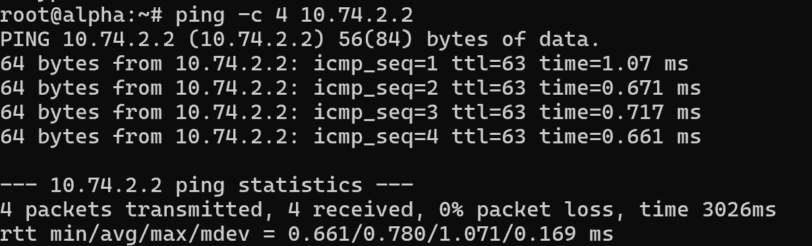
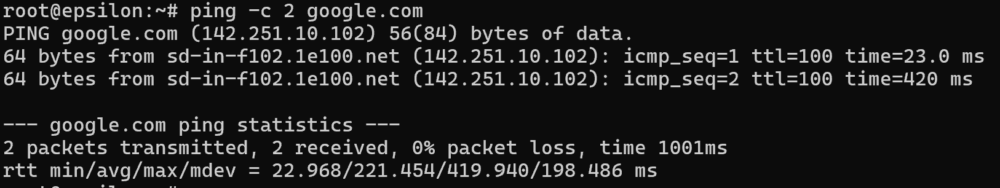
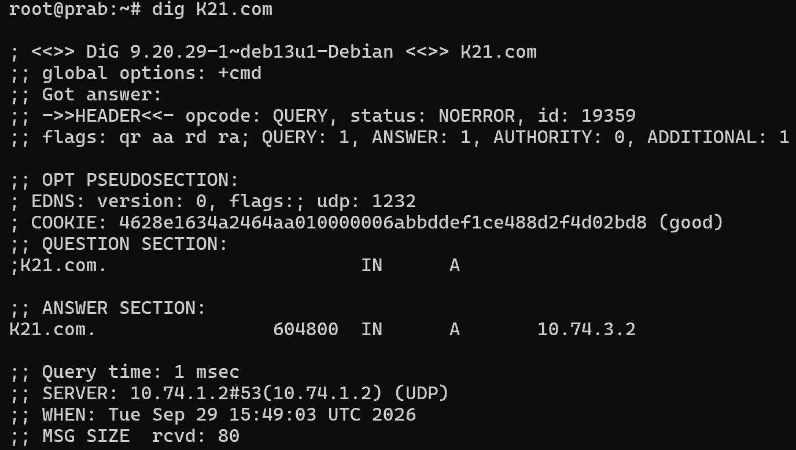
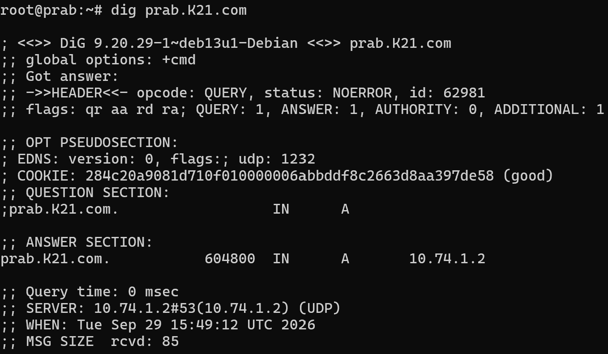
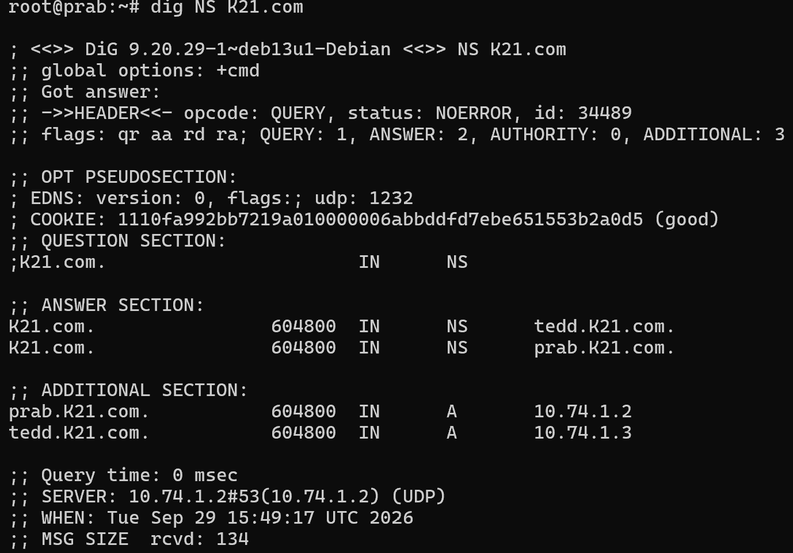
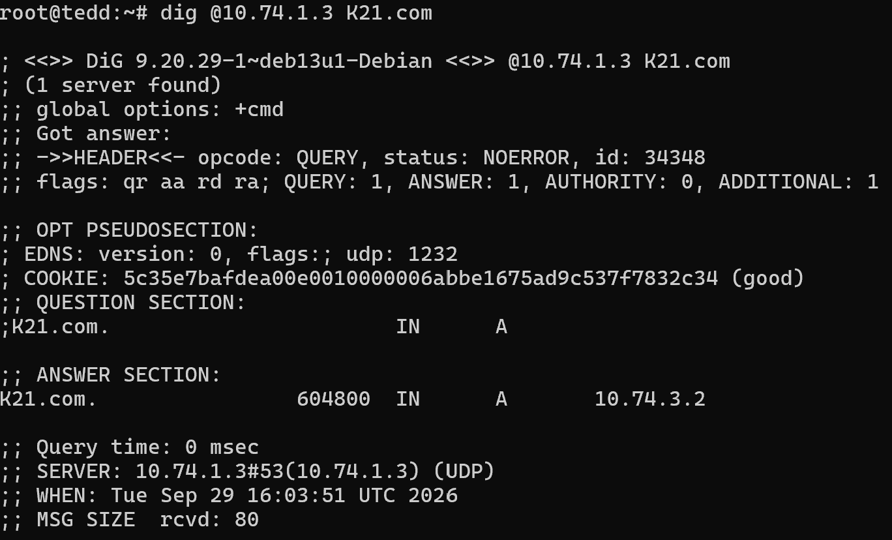

# Jarkom-Modul-2-2026-K-21

| Nama                          | NRP        |
| ----------------------------- | ---------- |
| Revalinda Bunga Nayla Laksono | 5027251011 |
| Najla Tufailah                | 5027251078 |

## 1
**rootkit harus merentangkan ke 5 gerbang utama (Switch), dengan menepatkan alamat IP dan default gateway, mulai dari para operator (alpha, beta, gamma), penjaga directory (prab, tedd), gerbang penyaring (abbey, penny), hingga repository (obladi, desmond, oblada, molly)**


Topologi ini dibangun dengan **rootkit** sebagai router utama yang juga terhubung dengan 5 jalur (switch) yaitu: 
1. Jalur sayap kiri, melalui Switch6, yang menghubungkan klien alpha, beta, dan gamma.
2. Jalur sayap kanan, melalui Switch7, yang menghubungkan klien delta dan epsilon.
3. Jalur gerbang penyaring pertama, melalui Switch4, yang menghubungkan klien abbey sebagai reverse proxy.
4. Jalur gerbang penyaring kedua, melalui Switch5, yang menghubungkan klien penny sebagai reverse proxy.
5. Jalur repository dan directory, melalui Switch1 yang diteruskan ke Switch2 dan Switch3, yang menghubungkan prab, tedd, obladi, desmond, oblada, dan molly.

### Konfigurasi Jaringan
- rootkit
```
auto eth0
iface eth0 inet dhcp

auto eth1
iface eth1 inet static
  address 10.74.1.1
  netmask 255.255.255.0

auto eth2
iface eth2 inet static
  address 10.74.2.1
  netmask 255.255.255.0

auto eth3
iface eth3 inet static
  address 10.74.3.1
  netmask 255.255.255.0

auto eth4
iface eth4 inet static
  address 10.74.4.1
  netmask 255.255.255.0

auto eth5
iface eth5 inet static
  address 10.74.5.1
  netmask 255.255.255.0
```
- prab
```
auto eth0
iface eth0 inet static
    address 10.74.1.2
    netmask 255.255.255.0
    gateway 10.74.1.1
```

- tedd

```
auto eth0
iface eth0 inet static
    address 10.74.1.3
    netmask 255.255.255.0
    gateway 10.74.1.1
```

- obladi
```
auto eth0
iface eth0 inet static
    address 10.74.1.4
    netmask 255.255.255.0
    gateway 10.74.1.1
```
- desmond
```
auto eth0
iface eth0 inet static
    address 10.74.1.5
    netmask 255.255.255.0
    gateway 10.74.1.1
```
- oblada
```
auto eth0
iface eth0 inet static
    address 10.74.1.6
    netmask 255.255.255.0
    gateway 10.74.1.1
```
- molly
```
auto eth0
iface eth0 inet static
    address 10.74.1.7 
    netmask 255.255.255.0
    gateway 10.74.1.1
```
- abbey
```
auto eth0
iface eth0 inet static
    address 10.74.2.2
    netmask 255.255.255.0
    gateway 10.74.2.1
```
- penny
```
auto eth0
iface eth0 inet static
    address 10.74.3.2
    netmask 255.255.255.0
    gateway 10.74.3.1
```
- alpha
```
auto eth0
iface eth0 inet static
    address 10.74.4.2
    netmask 255.255.255.0
    gateway 10.74.4.1
```
- beta
```
auto eth0
iface eth0 inet static
    address 10.74.4.3
    netmask 255.255.255.0
    gateway 10.74.4.1
```
- gamma
```
auto eth0
iface eth0 inet static
    address 10.74.4.4
    netmask 255.255.255.0
    gateway 10.74.4.1
```
- delta
```
auto eth0
iface eth0 inet static
    address 10.74.5.2
    netmask 255.255.255.0
    gateway 10.74.5.1
```
- epsilon
```
auto eth0
iface eth0 inet static
    address 10.74.5.3
    netmask 255.255.255.0
    gateway 10.74.5.1
```


## 2
**Membuka jalur menuju NAT dengan memastikan antar muka WAN di router rootkit aktif. Mengonfigurasi NAT agar dapat meneruskan lalu lintas keluar bagi alamat internal, sehingga semua host di dalam jaringan dapat menjangkau internet publik menggunakan IP address**
Mengkonfigurasi NAT (Netwoek Address Translation) pada rootkit dilakukan agar dapat menerjemahkan setiap alamat IP privat client menjadi alamat IP publik ketika para client ingin mengakses internet. langkah pertama adalah memastikan iptables ada dengan 
```
apt update
apt install -y iptables
```
Kemudian konfigurasi `eth0` dan NAT pada `rootkit`
```
auto eth0
iface eth0 inet dhcp
up sysctl -w net.ipv4.ip_forward=1
up iptables -t nat -A POSTROUTING -o eth0 -j MASQUERADE -s 10.74.0.0/16
```
Konfigurasi tersebut berfungsi untuk:
- `up` → Menjalankan perintah ini ketika interface tersebut berhasil diaktifkan.
- `eth0` → antarmuka WAN yang terhubung ke NAT.
- `ip_forward=1` → mengaktifkan penerusan paket antarjaringan.
- `MASQUERADE` → menerjemahkan IP privat client menjadi alamat IP pada eth0.
- `10.74.0.0/16` → menentukan jaringan internal yang menggunakan NAT.

### Pembuktian
Pengujian dilakukan dari client `obladi` dengan melakukan `ping` ke alamat IP `8.8.8.8` untuk memastikan client dapat terhubung ke internet melalui router `rootkit`. Penggunaan alamat IP secara langsung memastikan pengujian tidak bergantung pada proses DNS.


## 3
**Memastikan setiap host non-router menambahkan resolver 192.168.122.1 saat antarmukanya aktif agar akses untuk mengunduh paket isntalasi dari internet tersedia sejak awal beroprasi**
Konfigurasi dilakukan agar seluruh host pada jaringan internal dapat saling berkomunikasi antar-subnet dan dapat melakukan resolusi nama domain menggunakan DNS resolver `192.168.122.1`. <br> <br>
Setiap host dikonfigurasi menggunakan IP address sesuai subnet masing-masing dan `rootkit` sebagai default gateway. Dengan demikian, paket dari satu subnet dapat diteruskan oleh `rootkit` menuju subnet lainnya. <br> <br>
DNS resolver dikonfigurasi pada setiap host menggunakan:
```bash
echo "nameserver 192.168.122.1" > /etc/resolv.conf
```
### pembuktian
- pengujian routing internal dilakukan dari **alpha** menuju host pada subnet lain, yaitu **abbey** dengan alamat `10.74.2.2`

- Pengujian DNS dilakukan dengan melakukan ping menggunakan nama domain:


## 4
**ISI SOALNYA APA**

## 4

**Penjaga Direktori mulai menuliskan hukum The Mesh. Pada node prab, bangun zona <xxxx>.com sebagai authoritative dengan SOA yang menunjuk ke prab.<xxxx>.com, serta tambahkan catatan NS untuk prab.<xxxx>.com dan tedd.<xxxx>.com. Buat A record untuk prab.<xxxx>.com dan tedd.<xxxx>.com yang mengarah ke alamat IP mereka masing-masing, serta A record apex <xxxx>.com yang mengarah ke gerbang aplikasi dinamis (penny). Aktifkan fitur notify dan allow-transfer ke tedd, lalu set forwarders ke 192.168.122.1. Di node tedd, tarik zona <xxxx>.com dari master dan pastikan server menjawab secara authoritative. Setelah fondasi nama ini berdiri kokoh, perbarui urutan resolver pada seluruh Entitas non-router menjadi: IP prab, IP tedd, lalu 192.168.122.1. Verifikasi bahwa query ke domain apex maupun hostname di dalam zona dijawab dengan benar oleh prab atau tedd.**

Dalam skema ini, **Prab** bertindak sebagai **server DNS master** yang memegang kendali utama, sedangkan **Tedd** disiapkan sebagai **server DNS slave**. Kehadiran Tedd memastikan kontinuitas layanan ketika Prab tidak dapat beroperasi.

| Node | Peran | IP |
|------|-------|-----|
| Prab | DNS Master | `10.74.1.2` |
| Tedd | DNS Slave | `10.74.1.3` |
| Penny | Gerbang aplikasi dinamis | `10.74.3.2` |

---

## Konfigurasi Prab (DNS Master)

### 1. Instalasi BIND9

```bash
apt update
apt install bind9 dnsutils -y
ln -s /etc/init.d/named /etc/init.d/bind9

# Edit /etc/bind/named.conf.local untuk mendaftarkan zona
nano /etc/bind/named.conf.local
```

### 2. Mendaftarkan Zona

Isi `/etc/bind/named.conf.local`:

```
zone "K21.com" {
    type master;
    file "/etc/bind/jarkom/K21.com";
    notify yes;
    allow-transfer { 10.74.1.3; };
    also-notify { 10.74.1.3; };
};
```

| Direktif | Penjelasan |
|----------|------------|
| `type master` | Prab adalah pemilik data asli zona ini. |
| `notify yes` + `also-notify` | Prab otomatis memberi tahu Tedd setiap ada perubahan zona, sehingga Tedd tidak perlu menunggu jadwal *refresh*. |
| `allow-transfer` | Membatasi siapa yang boleh menarik salinan zona. Hanya Tedd (`10.74.1.3`) yang diizinkan. Jika dibuka untuk semua orang, seluruh isi zona bisa dibaca siapa saja. |

### 3. Opsi Global BIND

Edit `/etc/bind/named.conf.options`:

```bash
nano /etc/bind/named.conf.options
```

```
options {
    directory "/var/cache/bind";
    forwarders {
        192.168.122.1;
    };
    allow-query { any; };
    dnssec-validation no;
    listen-on-v6 { any; };
};
```

- **`forwarders`**: jika ada query untuk domain di luar zona kita (misalnya `google.com`), BIND meneruskannya ke `192.168.122.1` alih-alih mencari sendiri.
- **`allow-query { any; }`**: mengizinkan semua host bertanya ke server ini.

### 4. Membuat File Zona

```bash
mkdir -p /etc/bind/jarkom

cat <<'EOF' > /etc/bind/jarkom/K21.com
$TTL    604800
@       IN      SOA     prab.K21.com. root.K21.com. (
                        2026092801      ; Serial
                        604800          ; Refresh
                        86400           ; Retry
                        2419200         ; Expire
                        604800 )        ; Negative Cache TTL
;
@       IN      NS      prab.K21.com.
@       IN      NS      tedd.K21.com.
prab    IN      A       10.74.1.2
tedd    IN      A       10.74.1.3
@       IN      A       10.74.3.2
EOF

named-checkconf
named-checkzone K21.com /etc/bind/jarkom/K21.com
service bind9 restart
```

> **Catatan:** `'EOF'` (dengan tanda kutip) dipakai agar shell tidak mengubah `$TTL` menjadi string kosong.

**Isi file zona:**

| Record | Fungsi |
|--------|--------|
| `SOA` | Data otoritatif zona: name server utama (`prab.K21.com.`), email admin (`root.K21.com.`), serta parameter *serial*, *refresh*, *retry*, *expire*, dan *negative cache TTL*. Serial harus dinaikkan setiap zona diubah agar slave tahu ada versi baru. |
| `NS` | Mendaftarkan `prab` dan `tedd` sebagai name server resmi untuk `K21.com`. |
| `A prab` / `A tedd` | Memetakan hostname name server ke IP masing-masing. |
| `@ A 10.74.3.2` | Domain utama `K21.com` mengarah ke Penny (gerbang aplikasi dinamis). |

`named-checkconf` dan `named-checkzone` memvalidasi sintaks konfigurasi dan file zona sebelum BIND direstart.

### 5. Memperbaiki Urutan Resolver di Setiap Host

```bash
cat <<EOF > /root/.bashrc
echo "nameserver 10.74.1.2" > /etc/resolv.conf
echo "nameserver 10.74.1.3" >> /etc/resolv.conf
echo "nameserver 192.168.122.1" >> /etc/resolv.conf
EOF
```

Setiap kali shell dibuka, `/etc/resolv.conf` diatur ulang dengan urutan prioritas:

1. `10.74.1.2` (Prab, master)
2. `10.74.1.3` (Tedd, slave, sebagai cadangan jika Prab mati)
3. `192.168.122.1` (resolver luar, untuk domain di luar zona)

---

## Konfigurasi Tedd (DNS Slave)

```bash
apt update
apt install bind9 dnsutils -y
ln -s /etc/init.d/named /etc/init.d/bind9

# Edit /etc/bind/named.conf.local untuk mendaftarkan zona
nano /etc/bind/named.conf.local
```

Isi `/etc/bind/named.conf.local`:

```
zone "K21.com" {
    type slave;
    masters { 10.74.1.2; };
    file "/var/lib/bind/K21.com";
};
```

- `type slave`: Tedd hanya menyalin data zona dari master.
- `masters { 10.74.1.2; }`: sumber salinan zona adalah Prab.
- `file`: lokasi penyimpanan salinan zona hasil transfer di Tedd.

---

## Pembuktian

### Tes resolusi DNS langsung dari Prab

**1. Query domain utama**

```bash
dig K21.com
```



- `SERVER: 10.74.1.2`: query dijawab langsung oleh Prab, bukan diteruskan ke `192.168.122.1`. Ini membuktikan urutan `resolv.conf` sudah benar.
- `aa` (*Authoritative Answer*) di flags: Prab menjawab sebagai pemilik zona, bukan sekadar cache/forward dari server lain.
- Record `A` bernilai `10.74.3.2`, sesuai dengan IP Penny (gerbang aplikasi dinamis).

**2. Query hostname name server**

```bash
dig prab.K21.com
```



Hostname `prab.K21.com` juga dijawab dengan `aa`, dan IP-nya cocok dengan IP asli Prab (`10.74.1.2`). Ini membuktikan record `A` untuk name server sudah dikonfigurasi benar di zona.

**3. Query record NS**

```bash
dig NS K21.com
```



- Dua record NS terdaftar untuk zona `K21.com`, yaitu `prab.K21.com` dan `tedd.K21.com`.
- `ADDITIONAL SECTION` otomatis melampirkan IP masing-masing NS (*glue records*), menunjukkan record `A` Prab dan Tedd terhubung dengan benar ke record NS-nya.
- Semua dijawab dengan `aa`, dan sumbernya `10.74.1.2` (Prab sendiri), bukan dari luar.

### Tes resolusi DNS dari Tedd

```bash
dig @10.74.1.3 K21.com
```



- `SERVER: 10.74.1.3#53`: query dikirim dan dijawab langsung oleh Tedd (bukan diteruskan ke Prab atau forwarder luar). Ini membuktikan Tedd sudah punya salinan zona dan dapat menjawab query DNS secara mandiri.
- `aa` di flags: Tedd menganggap dirinya *authoritative* untuk `K21.com`. Ini menunjukkan zone transfer berhasil dan Tedd memiliki salinan zona yang lengkap, persis seperti Prab. Jika transfer gagal, Tedd tidak akan memiliki data zona sehingga tidak bisa menjawab dengan flag `aa`.
- `ANSWER SECTION: K21.com. → 10.74.3.2`: hasilnya identik dengan jawaban Prab (mengarah ke Penny). Ini membuktikan data di Tedd sinkron dengan data master di Prab.


## 5
**"Entitas tanpa identitas adalah anomali," pesan Rootkit. Namai semua Entitas (hostname) sesuai glosarium: rootkit, alpha, beta, gamma, delta, epsilon, prab, tedd, abbey, penny, obladi, desmond, oblada, molly, dan verifikasi bahwa setiap host mengenali hostname tersebut secara system-wide. Buat setiap domain untuk masing-masing node sesuai dengan namanya (contoh: alpha.<xxxx>.com) dan assign IP masing-masing juga. Lakukan pengecualian untuk node yang bertanggung jawab atas prab dan tedd.**

## 1.Konfigurasi dulu hostname persisten(/root/script.sh)
untuk memastikan hostname dan resolver DNS tetap aktif setiap kali node di reboot, dibuat script otomatis ```/root/script.s``` di setiap node.

**Script pada node client**(`alpha`,`beta`,`gamma`,`delta`,`epsilon`,`abbey`,`penny`,`obladi`,`Desmond`,`oblada`,`molly`)

```c
NODE_NAME="<nama_node>"

cat << EOF > /root/script.sh
#!/bin/bash
hostnamectl set-hostname $NODE_NAME 2>/dev/null || echo "$NODE_NAME" > /etc/hostname
hostname $NODE_NAME

cat <<RESOLV > /etc/resolv.conf
nameserver 10.74.1.2
nameserver 10.74.1.3
nameserver 192.168.122.1
RESOLV
EOF

chmod +x /root/script.sh
bash /root/script.sh
```
**Script pada DNS Master.**
```c
cat << 'EOF' > /root/script.sh
#!/bin/bash
hostnamectl set-hostname prab 2>/dev/null || echo "prab" > /etc/hostname
hostname prab

cat <<RESOLV > /etc/resolv.conf
nameserver 10.74.1.2
nameserver 10.74.1.3
nameserver 192.168.122.1
RESOLV

service bind9 restart
EOF

chmod +x /root/script.sh
bash /root/script.sh
```
## 2. Pendaftaran A record pada Zone File BIND9
Di node prab (`DNS Master`), file konfigurasi zona`/etc/bind/jarkom/K21.com` diperbarui dengan menambahkan resource record jenis A untuk seluruh node jaringan:

```C
$TTL    604800
@       IN      SOA     K21.com. root.K21.com. (
                     2026092901         ; Serial
                         604800         ; Refresh
                          86400         ; Retry
                        2419200         ; Expire
                         604800 )       ; Negative Cache TTL
;
@       IN      NS      prab.K21.com.
@       IN      NS      tedd.K21.com.

; DNS Server Record (Soal 4)
prab    IN      A       10.74.1.2
tedd    IN      A       10.74.1.3

; Node Domain Mapping (Soal 5)
alpha   IN      A       10.74.4.2
beta    IN      A       10.74.4.3
gamma   IN      A       10.74.4.4
delta   IN      A       10.74.5.2
epsilon IN      A       10.74.5.3
abbey   IN      A       10.74.2.2
penny   IN      A       10.74.3.2
obladi  IN      A       10.74.1.4
desmond IN      A       10.74.1.5
oblada  IN      A       10.74.1.6
molly   IN      A       10.74.1.7
```
Setelah dilakukan perubahan file zona, validasi syntax dan restart BIND9 dijalankan:
```c
# Cek validasi sintaks zone file di prab
named-checkzone K21.com /etc/bind/jarkom/K21.com

# Restart service BIND9 di prab dan tedd
service bind9 restart
```
## 3. Pengujian
pengujian bisa di node mana saja, saya mencoba dari node `Molly` menggunakan perintah host 
```c
host alpha.K21.com
host beta.K21.com
host abbey.K21.com
host oblada.K21.com
```
pengujian hostname Ketik perintah ini di terminal node manapun (misal di molly atau alpha)
```c
hostname
```
Hasil


## 6. 
Pastikan zone transfer berjalan, pastikan tedd telah menerima salinan zona terbaru dari prab. Nilai serial SOA di keduanya harus sama karena keduanya tidak bisa dipisahkan dan saling melengkapi.

## 6.1. Konfigurasi BIND9 Slave pada Node `tedd`
Mengakses node`tedd`(`10.74.1.3`)dan mengonfigurasi file `/etc/bind/named.conf.local`
agar bertindak sebagai DNS Slave:
```c
zone "K21.com" {
    type slave;
    file "/var/cache/bind/db.K21.com";
    masters { 10.74.1.2; };
};
```
## 6.2. Memuat ulang layanan BIND9 dengan perintah `service bind9 restart.`
## 6.3. Verifikasi Pembentukan File Zone Transfer di Slave (`tedd`)
Tujuan: Memastikan BIND9 Master `prab` berhasil men-transfer file zone ke BIND9 Slave `tedd`.

Eksekusi:
Menjalankan perintah `ls -l /var/cache/bind/db.K21.com di terminal` `tedd`.

Hasil:


## 6.4. Membuktikan bahwa nilai Serial SOA di Master dan Slave 
Tujuan: identik sebagai syarat mutlak sinkronisasi data DNS. Kesamaan Serial SOA antara Master dan Slave

Eksekusi:
Menjalankan query DNS SOA dari node client (molly) ke IP Master dan Slave secara berurutan
`host -t SOA K21.com 10.74.1.2
 host -t SOA K21.com 10.74.1.3`

 Hasil:
 

 ## Verifikasi Otorisasi ZOne Transfer Menggunakan AXFR
 Tujuan: Menguji apakah permintaan pemindahan seluruh database zone `AXFR` dari `tedd` dan `prab` diizinkan.

 Eksekusi:
 Menjalankan perintah `dig @10.74.1.2 K21.com AXFR` langsung di terminal `tedd`.

 Hasil:
 

## 7.
## 7.1  
Tujuan: Menonfigurasi subdomain `vault.K21.com`(web statis) dan `core.K21.com`(web dinamis) dengan pemetaan multi-IP, serta menambahkan alias CNAME `WWWW` dan `static`
selanjutnya menverifikasi konsistensi resolusi nama dari dua node klien berbeda.

## 7.2
Konfigurasi dan Pengujian
### A. Pembaruan Zone File Master `prab`
Mengedit file zona /etc/bind/jarkom/K21.com dan menaikkan Serial SOA menjadi 2026092903:
```c
; Web Statis (vault) & Web Dinamis (core)
vault   IN      A       10.74.1.4
vault   IN      A       10.74.1.5
core    IN      A       10.74.1.6
core    IN      A       10.74.1.7

; Alias (CNAME)
www     IN      CNAME   penny.K21.com.
static  IN      CNAME   abbey.K21.com.
```
Perintah Eksekusi: `named-checkzone K21.com /etc/bind/jarkom/K21.com && service bind9 restart`

### B. Verifikasi dari Dua klien berbeda
pengujian pada klien 1 `aplha`
```c
host vault.K21.com
host core.K21.com
host www.K21.com
host static.K21.com
```
Hasil: vault merespons IP 10.74.1.4 & 10.74.1.5, core merespons IP 10.74.1.6 & 10.74.1.7, www mengarah ke CNAME penny.K21.com (10.74.3.2), dan static mengarah ke CNAME abbey.K21.com (10.74.2.2).


pengujian pada klien 2 `alpha`
```c
host vault.K21.com
host core.K21.com
host www.K21.com
host static.K21.com
```
Hasil: 100% sama dengan hasil resolusi pada `alpha`


## 8.
## 8.1 Konfigurasi reserve DNS(PTR Record) Master & Slave
Tujuan: Mendeklarasikan Reverse DNS Zone pada segmen jaringan abbey (10.74.2.x), penny (10.74.3.x), area vault (10.74.1.4 & 10.74.1.5), serta area core (10.74.1.6 & 10.74.1.7). Mengonfigurasi Master (prab) dan Slave (tedd) agar query pencarian balik IP (Reverse Lookup) mengembalikan hostname yang tepat dan bersifat authoritative.

### A. Deklarasi & Pembuatan Zone File di DNS Master (prab)
Deklarasi Zone pada /etc/bind/named.conf.local:
```c
zone "1.74.10.in-addr.arpa" {
    type master;
    file "/etc/bind/jarkom/1.74.10.in-addr.arpa";
    notify yes;
    allow-transfer { 10.74.1.3; };
};

zone "2.74.10.in-addr.arpa" {
    type master;
    file "/etc/bind/jarkom/2.74.10.in-addr.arpa";
    notify yes;
    allow-transfer { 10.74.1.3; };
};

zone "3.74.10.in-addr.arpa" {
    type master;
    file "/etc/bind/jarkom/3.74.10.in-addr.arpa";
    notify yes;
    allow-transfer { 10.74.1.3; };
};
```
Isi File Reverse Zone (/etc/bind/jarkom/1.74.10.in-addr.arpa - Vault & Core):
```c
$TTL    604800
@       IN      SOA     prab.K21.com. root.K21.com. (
                        2026093001      ; Serial
                        604800          ; Refresh
                        86400           ; Retry
                        2419200         ; Expire
                        604800 )        ; Negative Cache TTL
;
@       IN      NS      prab.K21.com.
@       IN      NS      tedd.K21.com.

4       IN      PTR     obladi.K21.com.
5       IN      PTR     desmond.K21.com.
6       IN      PTR     oblada.K21.com.
7       IN      PTR     molly.K21.com.
```
Isi File Reverse Zone 2 & 3 (`2.74.10` & `3.74.10)`:
`2.74.10.in-addr.arpa` (Abbey): `2 IN PTR abbey.K21.com.`
`3.74.10.in-addr.arpa` (Penny): `2 IN PTR penny.K21.com.`

### B. Konfigurasi Pull Zone di DNS Slave (tedd)
Menambahkan deklarasi slave zone pada /etc/bind/named.conf.local:
```c
zone "1.74.10.in-addr.arpa" {
    type slave;
    file "/var/cache/bind/db.1.74.10";
    masters { 10.74.1.2; };
};

zone "2.74.10.in-addr.arpa" {
    type slave;
    file "/var/cache/bind/db.2.74.10";
    masters { 10.74.1.2; };
};

zone "3.74.10.in-addr.arpa" {
    type slave;
    file "/var/cache/bind/db.3.74.10";
    masters { 10.74.1.2; };
};
```
## 8.2. Hasil Verifikasi & Pengujian
### A. Verifikasi Hasil Zone Transfer di Slave (tedd)
Perintah: ls -la /var/cache/bind/

Hasil: File db.1.74.10, db.2.74.10, dan db.3.74.10 berhasil diterima dan tersimpan otomatis dari Master (prab).


### B. Testing Reverse Lookup dari Klien (alpha)
Menguji query resolusi balik IP ke DNS Master (10.74.1.2) dan DNS Slave (10.74.1.3):

Query ke DNS Master (10.74.1.2):
```c
host 10.74.2.2 10.74.1.2
host 10.74.3.2 10.74.1.2
host 10.74.1.4 10.74.1.2
host 10.74.1.6 10.74.1.2
```
Hasil:
`10.74.2.2` → `abbey.K21.com.`
`10.74.3.2` → `penny.K21.com.`
`10.74.1.4` → `obladi.K21.com.`
`10.74.1.6` → `oblada.K21.com.`
Query ke DNS Slave (10.74.1.3):
```c
host 10.74.2.2 10.74.1.3
host 10.74.3.2 10.74.1.3
host 10.74.1.4 10.74.1.3
host 10.74.1.6 10.74.1.3
```
Hasil: Respon dari Slave identik 100% dengan Master, membuktikan bahwa Slave server telah bertindak sebagai otoritas (authoritative) untuk seluruh zone PTR tersebu


## 9 Konfigurasi Web Server Statis & Autoindex pada Area Vault
## 9.1 Deskripsi Soal & Tujuan
Tujuan: Menyiapkan layanan web statis menggunakan Apache2 pada node area vault (obladi: 10.74.1.4 dan desmond: 10.74.1.5).
Fitur Utama: Mengaktifkan fitur Autoindex (directory listing) pada direktori /arsip/ sehingga seluruh daftar file di dalamnya dapat dilihat dan diunduh secara langsung dari browser/curl.
Syarat Akses: Pengujian wajib dilakukan melalui domain `http://vault.K21.com/arsip/](http://vault.K21.com/arsip/)` (bukan melalui alamat IP langsung).

## 9.2 Langkah Implemetasi Script
### A. Konfigurasi Apache di Node Area Vault (obladi & desmond)
Jalankan perintah berikut di terminal obladi dan desmond:
```c
# 1. Update repositori dan install paket web server Apache2
apt-get update && apt-get install -y apache2

# 2. Membuat direktori /arsip/ di DocumentRoot Apache beserta file sampel
mkdir -p /var/www/html/arsip
echo "Dokumen Rahasia Vault 1" > /var/www/html/arsip/dokumen1.txt
echo "Laporan Keuangan" > /var/www/html/arsip/laporan.pdf
touch /var/www/html/arsip/backup.zip

# 3. Membuat file VirtualHost untuk domain vault.K21.com
cat << 'EOF' > /etc/apache2/sites-available/vault.conf
<VirtualHost *:80>
    ServerName vault.K21.com
    ServerAlias obladi.K21.com desmond.K21.com
    DocumentRoot /var/www/html

    # Mengaktifkan Directory Listing (Autoindex) untuk folder /arsip/
    <Directory /var/www/html/arsip>
        Options +Indexes +FollowSymLinks
        AllowOverride None
        Require all granted
    </Directory>
</VirtualHost>
EOF
```
```c
a2enmod autoindex
a2ensite vault.conf
a2dissite 000-default.conf
service apache2 restart
```
### B. Konfigurasi DNS Resolver pada Client (beta)
Arahkan resolver DNS di node beta ke Master DNS (10.74.1.2) dan Slave DNS (10.74.1.3):
```c
cat << 'EOF' > /etc/resolv.conf
nameserver 10.74.1.2
nameserver 10.74.1.3
EOF
```
## 9.3 Verifikasi & Pengujian
Perintah pengujian dijalankan dari terminal `beta`:
Uji Resolusi Domain Hostname:
```c
host vault.K21.com
```
Hasil: Hostname vault.K21.com berhasil diterjemahkan ke IP 10.74.1.4 (obladi) dan 10.74.1.5 (desmond)

Uji Akses Web Directory Listing (/arsip/):
```c
curl -i http://vault.K21.com/arsip/
```


## 10
## 10.1 Deskripsi Soal & Tujuan
Tujuan: Menyiapkan layanan web server dinamis menggunakan Nginx dan PHP-FPM di node area core (`oblada`: `10.74.1.6` dan `Molly`: `10.74.1.7`)

Fitur Utama: Menyediakan aplikasi web sederhana (halaman Beranda dan Profil) serta menerapkan aturan URL Rewriting pada Nginx agar halaman profil dapat diakses menggunakan Clean URL (/`profil` tanpa ekstensi `.php`).

Syarat Akses: Pengujian wajib dilakukan dari client menggunakan hostname `[http://core.K21.com/](http://core.K21.com/)` dan `[http://core.K21.com/profil](http://core.K21.com/profil).`

## 10.2 Script
### A. Konfigurasi Nginx & PHP-FPM di Node Area Core (oblada & molly)
Jalankan perintah berikut pada terminal`oblada`dan`molly`:
```c
# 1. Update repositori dan install paket Nginx + PHP-FPM
apt-get update && apt-get install -y nginx php-fpm

# 2. Buat direktori web & file aplikasi PHP
mkdir -p /var/www/core

cat << 'EOF' > /var/www/core/index.php
<?php
echo "<h1>Selamat Datang di Halaman Beranda Node Core</h1>";
echo "<p>Server IP: " . $_SERVER['SERVER_ADDR'] . "</p>";
echo "<a href='/profil'>Ke Halaman Profil</a>";
?>
EOF

cat << 'EOF' > /var/www/core/profil.php
<?php
echo "<h1>Halaman Profil Node Core</h1>";
echo "<p>Ini adalah halaman profil dengan URL bersih (Clean URL).</p>";
echo "<a href='/'>Kembali ke Beranda</a>";
?>
EOF

# 3. Buat VirtualHost Nginx dengan aturan URL Rewrite
cat << 'EOF' > /etc/nginx/sites-available/core
server {
    listen 80;
    server_name core.K21.com oblada.K21.com molly.K21.com;
    root /var/www/core;
    index index.php index.html;

    # Aturan Rewrite untuk Clean URL (/profil -> profil.php)
    location / {
        try_files $uri $uri/ $uri.php?$args;
    }

    # Teruskan eksekusi file .php ke socket PHP 8.4 FastCGI
    location ~ \.php$ {
        include snippets/fastcgi-php.conf;
        fastcgi_pass unix:/run/php/php8.4-fpm.sock;
    }
}
EOF

# 4. Aktifkan VirtualHost & restart service Nginx + PHP-FPM
ln -sf /etc/nginx/sites-available/core /etc/nginx/sites-enabled/
rm -f /etc/nginx/sites-enabled/default

service php8.4-fpm restart
nginx -t && service nginx restart
```
### B. Analisis perintah utama
turan kunci untuk mengaktifkan Clean URL terletak pada direktif try_files $uri $uri/ $uri.php?$args;. Perintah ini memerintahkan Nginx mencari file secara berurutan; ketika URL /profil diakses, Nginx otomatis mengeksekusi file profil.php di latar belakang tanpa mengubah tampilan URL klien. Proses eksekusi script PHP tersebut diteruskan ke modul PHP-FPM melalui koneksi socket fastcgi_pass unix:/run/php/php8.4-fpm.sock;. Sementara itu, direktif index index.php; memastikan Nginx secara otomatis memuat file index.php saat domain core.K21.com diakses.

## 10.3 Verifikasi pengujian
Perintah pengujian dijalankan dari terminal client(`alpha`dan`beta`)
```c
curl -i http://core.K21.com/
curl -i http://core.K21.com/profil
```


# 11
**Konfigurasikan Penny (menggunakan Apache) sebagai reverse proxy yang mengarah ke semua node di area vault (Obladi & Desmond). Sementara itu, konfigurasikan Abbey (menggunakan Nginx) sebagai reverse proxy menuju area core (Oblada & Molly). Pastikan kedua gerbang ini meneruskan identitas asli pengunjung ke server backend dengan melakukan forwarding header Host dan X-Real-IP. Buktikan bahwa Penny dan Abbey berhasil mendistribusikan lalu lintas dengan tepat.**

**Gerbang (reverse proxy):** Penny (area vault), Abbey (area core)
**Backend area vault:** obladi (10.74.1.4), desmond (10.74.1.5)
**Backend area core:** oblada (10.74.1.6), molly (10.74.1.7)
## Konfigurasi

### 11.1 Abbey — reverse proxy ke area core
 
File: `/etc/apache2/sites-available/core-proxy.conf`
 
```apache
<Proxy "balancer://corecluster">
    BalancerMember "http://10.74.1.6"
    BalancerMember "http://10.74.1.7"
</Proxy>
 
<VirtualHost *:80>
    ServerName abbey.K21.com
 
    RewriteEngine On
    RewriteCond %{REMOTE_ADDR} (.+)
    RewriteRule .* - [E=REAL_IP:%1]
 
    ProxyPreserveHost On
    RequestHeader set X-Real-IP %{REAL_IP}e
 
    ProxyPass "/" "balancer://corecluster/"
    ProxyPassReverse "/" "balancer://corecluster/"
 
    ErrorLog ${APACHE_LOG_DIR}/core-proxy-error.log
    CustomLog ${APACHE_LOG_DIR}/core-proxy-access.log combined
</VirtualHost>
```
 
Modul yang diaktifkan: `proxy`, `proxy_http`, `proxy_balancer`, `lbmethod_byrequests`, `headers`, `rewrite`.
 
**Catatan teknis:** header `X-Real-IP` tidak diambil langsung dari `%{REMOTE_ADDR}`, melainkan melalui perantara `mod_rewrite` (`RewriteRule ... [E=REAL_IP:%1]`). Hal ini diperlukan karena `RequestHeader` yang membaca `REMOTE_ADDR` secara langsung mengalami masalah urutan pemrosesan (timing) pada beberapa versi Apache, sehingga nilainya kerap tidak terbaca (`null`). Dengan menampung nilai `REMOTE_ADDR` ke variabel environment kustom (`REAL_IP`) melalui `mod_rewrite` terlebih dahulu, `RequestHeader` dapat membacanya dengan tepat waktu.


### 1.3 Penny — reverse proxy ke area vault
 
File: `/etc/apache2/sites-available/vault-proxy.conf`
 
```apache
<Proxy "balancer://vaultcluster">
    BalancerMember "http://10.74.1.4"
    BalancerMember "http://10.74.1.5"
</Proxy>
 
<VirtualHost *:80>
    ServerName penny.K21.com
 
    RewriteEngine On
    RewriteCond %{REMOTE_ADDR} (.+)
    RewriteRule .* - [E=REAL_IP:%1]
 
    ProxyPreserveHost On
    RequestHeader set X-Real-IP %{REAL_IP}e
 
    ProxyPass "/" "balancer://vaultcluster/"
    ProxyPassReverse "/" "balancer://vaultcluster/"
 
    ErrorLog ${APACHE_LOG_DIR}/vault-error.log
    LogFormat "%h Host:%{Host}i X-Real-IP:%{X-Real-IP}i \"%r\" %>s" proxytest
    CustomLog ${APACHE_LOG_DIR}/vault-access.log proxytest
</VirtualHost>
```
 
Modul yang diaktifkan: `proxy`, `proxy_http`, `proxy_balancer`, `lbmethod_byrequests`, `headers`, `rewrite`. Mekanisme penangkapan `X-Real-IP` memakai pendekatan `mod_rewrite` yang sama seperti di Abbey.


## 11.2 Bukti Forwarding Header (Host & X-Real-IP)
```bash
# console ablada
cat << 'EOF' > /var/www/core/heades.php
<?php
echo "Host yang diterima backend: " . $_SERVER['HTTP_HOST'] . "<br>\n";
echo "X-Real-IP yang diterima backend: " . $_SERVER['HTTP_X_REAL_IP'] . "<br>\n";
echo "Remote Addr asli (dari sudut pandang backend): " . $_SERVER['REMOTE_ADDR'] . "<br>\n";
echo "Server IP (menunjukkan backend mana yang menjawab): " . $_SERVER['SERVER_ADDR'] . "<br>\n";
EOF
```
Pengujian dilakukan dari klien **gamma** (10.74.4.4) ke gerbang **abbey**:
 
```
root@gamma:~# curl http://abbey.K21.com/headers
Host yang diterima backend: abbey.K21.com
X-Real-IP yang diterima backend: 10.74.4.4
Remote Addr asli (dari sudut pandang backend): 10.74.2.2
Server IP (menunjukkan backend mana yang menjawab): 10.74.1.6
```
 
**Analisis:**
 
| Header | Nilai diterima backend | Keterangan |
|---|---|---|
| `Host` | `abbey.K21.com` | Sesuai hostname gerbang yang diakses klien, **bukan** IP backend — membuktikan `ProxyPreserveHost On` berhasil meneruskan identitas Host asli ke backend. |
| `X-Real-IP` | `10.74.4.4` | Identik dengan IP klien asli (gamma), membuktikan header `X-Real-IP` berhasil disisipkan oleh proxy dan diteruskan ke backend. |
| `Remote Addr` | `10.74.2.2` | Ini adalah IP **abbey** (gerbang), dilihat dari sudut pandang koneksi TCP langsung ke backend. Nilai ini memang seharusnya IP gerbang, karena secara teknis abbey-lah yang membuka koneksi ke backend — inilah justru alasan header `X-Real-IP` diperlukan: untuk mengetahui identitas klien asli meskipun koneksi fisik berasal dari proxy. |
 
Kesimpulan: **identitas asli pengunjung (Host & IP klien) berhasil diteruskan dengan benar** oleh gerbang Abbey ke server backend.
 
---
 
## 11.3 Bukti Load Balancing (Distribusi Lalu Lintas)
 
Pengujian dilakukan dengan mengirim 10 kali request berturut-turut dari klien **gamma** ke `http://abbey.K21.com/`:
 
```
root@gamma:~# for i in {1..10}; do curl -s http://abbey.K21.com/ | grep "Server IP"; done
 
Server IP: 10.74.1.7
Server IP: 10.74.1.6
Server IP: 10.74.1.7
Server IP: 10.74.1.6
Server IP: 10.74.1.7
Server IP: 10.74.1.6
Server IP: 10.74.1.7
Server IP: 10.74.1.6
Server IP: 10.74.1.7
Server IP: 10.74.1.6
```
 
**Analisis:**
 
| IP Backend | Jumlah menjawab dari 10 request |
|---|---|
| 10.74.1.6 (oblada) | 5 kali |
| 10.74.1.7 (molly) | 5 kali |
 
Request yang dikirim secara berurutan dijawab **bergantian sempurna** antara oblada dan molly (pola round-robin 1:1). Ini membuktikan `mod_proxy_balancer` dengan algoritma `lbmethod_byrequests` berhasil **mendistribusikan lalu lintas secara merata** ke kedua anggota backend di area core, tidak hanya menumpuk ke satu server saja.

## 11.4 Bukti Forwarding Header & Load Balancing — Penny (Area Vault)
 
Pengujian dilakukan dengan mengirim dua rangkaian request dari klien **gamma** ke gerbang **penny**:
- 10× `curl http://penny.K21.com/arsip/`
- 10× `curl http://penny.K21.com/`
Total 20 request dikirim. Log akses dipantau secara bersamaan pada kedua backend (obladi dan desmond).
 
### 11.4.1 Log akses di Obladi
 
```
root@obladi:~# tail -f /var/log/apache2/vault-access.log
10.74.3.2 Host:penny.K21.com X-Real-IP:10.74.4.4 "GET /arsip/ HTTP/1.1" 200
10.74.3.2 Host:penny.K21.com X-Real-IP:10.74.4.4 "GET /arsip/ HTTP/1.1" 200
10.74.3.2 Host:penny.K21.com X-Real-IP:10.74.4.4 "GET /arsip/ HTTP/1.1" 200
10.74.3.2 Host:penny.K21.com X-Real-IP:10.74.4.4 "GET /arsip/ HTTP/1.1" 200
10.74.3.2 Host:penny.K21.com X-Real-IP:10.74.4.4 "GET /arsip/ HTTP/1.1" 200
10.74.3.2 Host:penny.K21.com X-Real-IP:10.74.4.4 "GET / HTTP/1.1" 200
10.74.3.2 Host:penny.K21.com X-Real-IP:10.74.4.4 "GET / HTTP/1.1" 200
10.74.3.2 Host:penny.K21.com X-Real-IP:10.74.4.4 "GET / HTTP/1.1" 200
10.74.3.2 Host:penny.K21.com X-Real-IP:10.74.4.4 "GET / HTTP/1.1" 200
10.74.3.2 Host:penny.K21.com X-Real-IP:10.74.4.4 "GET / HTTP/1.1" 200
```
Total: 10 baris (`wc -l` = 10)
 
### 11.4.2 Log akses di Desmond
 
```
root@desmond:~# tail -10 /var/log/apache2/vault-access.log
10.74.3.2 Host:penny.K21.com X-Real-IP:10.74.4.4 "GET /arsip/ HTTP/1.1" 200
10.74.3.2 Host:penny.K21.com X-Real-IP:10.74.4.4 "GET /arsip/ HTTP/1.1" 200
10.74.3.2 Host:penny.K21.com X-Real-IP:10.74.4.4 "GET /arsip/ HTTP/1.1" 200
10.74.3.2 Host:penny.K21.com X-Real-IP:10.74.4.4 "GET /arsip/ HTTP/1.1" 200
10.74.3.2 Host:penny.K21.com X-Real-IP:10.74.4.4 "GET /arsip/ HTTP/1.1" 200
10.74.3.2 Host:penny.K21.com X-Real-IP:10.74.4.4 "GET / HTTP/1.1" 200
10.74.3.2 Host:penny.K21.com X-Real-IP:10.74.4.4 "GET / HTTP/1.1" 200
10.74.3.2 Host:penny.K21.com X-Real-IP:10.74.4.4 "GET / HTTP/1.1" 200
10.74.3.2 Host:penny.K21.com X-Real-IP:10.74.4.4 "GET / HTTP/1.1" 200
10.74.3.2 Host:penny.K21.com X-Real-IP:10.74.4.4 "GET / HTTP/1.1" 200
```
Total: 10 baris (`wc -l` = 10)
 
 
### 11.4.3 Analisis
 
**Forwarding header:**
 
| Header | Nilai di log backend | Keterangan |
|---|---|---|
| `%h` (IP koneksi langsung) | `10.74.3.2` (IP Penny) | Sesuai ekspektasi — ini adalah IP gerbang yang membuka koneksi TCP ke backend, bukan IP klien. |
| `Host` | `penny.K21.com` | Sesuai hostname gerbang yang diakses klien — membuktikan `ProxyPreserveHost On` berhasil meneruskan identitas Host asli. |
| `X-Real-IP` | `10.74.4.4` | IP klien asli (gamma), bukan IP Penny — membuktikan header `X-Real-IP` berhasil disisipkan dan diteruskan ke backend. |
 
**Distribusi lalu lintas (load balancing):**
 
| Endpoint | Total request dikirim | Diterima Obladi | Diterima Desmond |
|---|---|---|---|
| `/arsip/` | 10 | 5 | 5 |
| `/` | 10 | 5 | 5 |
| **Total** | **20** | **10** | **10** |
 
Kedua backend menerima jumlah request yang **sama rata (10:10)** dari total 20 request yang dikirim, dengan pembagian 5:5 pada masing-masing endpoint. Hal ini membuktikan `mod_proxy_balancer` pada Penny berhasil mendistribusikan lalu lintas secara merata ke obladi dan desmond sesuai mekanisme round-robin.

## 12
## 12.1 Deskripsi soal & tujuan
Tujuan: Mengamankan direktori rahasia `/admin` di server `penny` menggunakan fitur basic authentication

Persyaratan: Memblokir seluruh akses tanpa kredensial `401 Unauthorized` dan hanya mengizinkan masuk pengguna yang menyertakan kombinasi kredensial username: `prabs` dan password: `pakar_pinter_jadi_gob***`

## 12.2 Eksekusi 
Eksekusi blok perintah berikut di terminal node `penny`:
```c
# 1. Install apache2-utils untuk membuat berkas kredensial
apt-get update && apt-get install -y apache2-utils

# 2. Buat direktori /admin dan dokumen rahasia
mkdir -p /var/www/html/admin
echo "<h1>Dokumen Rahasia Sindikat</h1>" > /var/www/html/admin/index.html

# 3. Generate berkas .htpasswd berisi kredensial terenkripsi
htpasswd -c -b /etc/apache2/.htpasswd prabs "pakar_pinter_jadi_gob***"

# 4. Tambahkan direktif Basic Authentication pada VirtualHost penny.conf
cat << 'EOF' > /etc/apache2/sites-available/penny.conf
<VirtualHost *:80>
    ServerName www.K21.com
    ServerAlias penny.K21.com
    DocumentRoot /var/www/html

    <Directory /var/www/html>
        Options Indexes FollowSymLinks
        AllowOverride All
        Require all granted
    </Directory>

    # Proteksi Basic Auth untuk path /admin
    <Directory /var/www/html/admin>
        AuthType Basic
        AuthName "Restricted Area"
        AuthUserFile /etc/apache2/.htpasswd
        Require valid-user
    </Directory>
</VirtualHost>
EOF

# 5. Aktifkan konfigurasi & restart layanan Apache
a2dissite 000-default.conf 2>/dev/null
a2ensite penny.conf
a2enmod auth_basic
service apache2 restart
```
## 12.3 Analisis Perintah Utama
Pengamanan direktori `/admin` mengandalkan modul Apache `auth_basic` serta utilitas `htpasswd` untuk mengenkripsi password. Di dalam VirtualHost, blok `<Directory` `/var/www/html/admin>` disisipi direktif `AuthType Basic` dan `AuthName "Restricted Area"` untuk mengaktifkan dialog autentikasi. Jalur berkas kata sandi ditentukan melalui `AuthUserFile /etc/apache2/.htpasswd`, sedangkan direktif Require valid-user memastikan hanya pengguna dengan autentikasi yang valid yang diberikan izin akses. Setiap permintaan tanpa header autentikasi yang sesuai akan ditolak secara otomatis oleh Apache dengan status respons HTTP 401 Unauthorized

## 12.4 Hasil Verifikasi & Pengujian
Pengujian dilakukan dari terminal klien (beta) menggunakan perintah curl:

Uji akses tanpa kredensial:
```c
curl -i http://www.K21.com/admin/
```


Uji akses dengan kredensial benar:
```c
curl -i -u prabs:'pakar_pinter_jadi_gob***' http://www.K21.com/admin/
```


## 13
## 13.1 Deskripsi soal & tujuan
Tujuan: Memastikan seluruh lalu lintas HTTP dipaksa mengakses nama kanonik (canonical domain) melalui Reverse Proxy.

Persyaratan Ketentuan Redirection:
Node penny (Apache2): Akses yang mengarah ke IP 10.74.3.2 maupun domain penny.K21.com wajib dialihkan secara permanen (Status Code 301 Moved Permanently) menuju `[www.K21.com](https://www.K21.com)`.

Node abbey (Nginx): Akses yang mengarah ke IP 10.74.2.2 maupun domain abbey.K21.com wajib dialihkan secara sementara (Status Code 302 Moved Temporarily) menuju static.K21.com.

## 13.2 Eksekusi
### A. Konfigurasi pada Node penny (Apache2)
jalankan di terminal `penny`
```c
# 1. Aktifkan modul rewrite pada Apache
a2enmod rewrite

# 2. Atur VirtualHost untuk domain kanonik dan Catch-All Redirect 301
cat << 'EOF' > /etc/apache2/sites-available/penny.conf
# VirtualHost Utama Canonical (www.K21.com)
<VirtualHost *:80>
    ServerName www.K21.com
    DocumentRoot /var/www/html

    <Directory /var/www/html>
        Options Indexes FollowSymLinks
        AllowOverride All
        Require all granted
    </Directory>

    <Directory /var/www/html/admin>
        AuthType Basic
        AuthName "Restricted Area"
        AuthUserFile /etc/apache2/.htpasswd
        Require valid-user
    </Directory>
</VirtualHost>

# VirtualHost Catch-All (IP & penny.K21.com -> Redirect 301)
<VirtualHost *:80>
    ServerName penny.K21.com
    ServerAlias 10.74.3.2

    RewriteEngine On
    RewriteCond %{HTTP_HOST} !^www\.K21\.com$ [NC]
    RewriteRule ^(.*)$ http://www.K21.com$1 [R=301,L]
</VirtualHost>
EOF

# 3. Restart layanan Apache
service apache2 restart
```
### B. Konfigurasi pada Node abbey (Nginx)
jalankan di terminal `abbey`
```c
# 1. Bersihkan symlink default
rm -rf /etc/nginx/sites-enabled/*

# 2. Tuliskan Server Block untuk domain kanonik dan Catch-All Redirect 302
cat << 'EOF' > /etc/nginx/sites-available/abbey
# Server Block Utama Canonical (static.K21.com)
server {
    listen 80;
    server_name static.K21.com;

    location / {
        proxy_pass http://vault.K21.com;
        proxy_set_header Host $host;
        proxy_set_header X-Real-IP $remote_addr;
        proxy_set_header X-Forwarded-For $proxy_add_x_forwarded_for;
    }
}

# Catch-All Redirect 302 (abbey.K21.com & IP 10.74.2.2)
server {
    listen 80 default_server;
    server_name abbey.K21.com 10.74.2.2 _;

    return 302 http://static.K21.com$request_uri;
}
EOF

# 3. Aktifkan symlink & restart Nginx
ln -sf /etc/nginx/sites-available/abbey /etc/nginx/sites-enabled/abbey
nginx -t && service nginx restart
```

## 13.3 Hasil Verifikasi & Pengujian
uji coba dari client `beta`
jalankan perintah pengujian di terminal client untuk membuktikan pengalihan URL:
A. uji coba node `penny`
```c
# Uji akses via domain penny.K21.com
curl -I http://penny.K21.com/

# Uji akses via IP penny
curl -I http://10.74.3.2/
```

B. uji coba node `abbey`
```c
# Uji akses via domain abbey.K21.com
curl -I http://abbey.K21.com/

# Uji akses via IP abbey
curl -I http://10.74.2.2/
```


